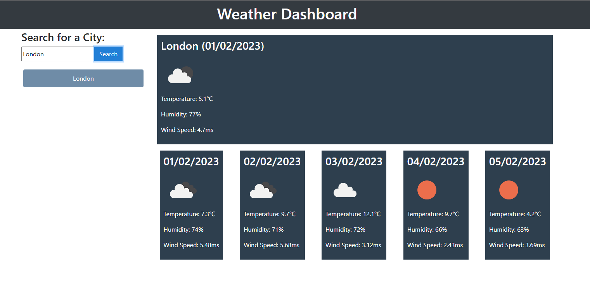

# Weather-Dashboard

## Description

The purpose of this application is allow a user to check the weather for an inputted city.
The application displays the current weather as well as the weather for the next 5 days.
The application saves previous searches that the user has made.

## Installation

N/A

## Usage

Enter a city in the input field.
Press the search button to generate weather data.

## Deployed Page

[Deployed Page](https://gthornbuckle.github.io/Weather-Dashboard/)

## Credits

George Hornbuckle

## License

Please refer to the license in the repo.